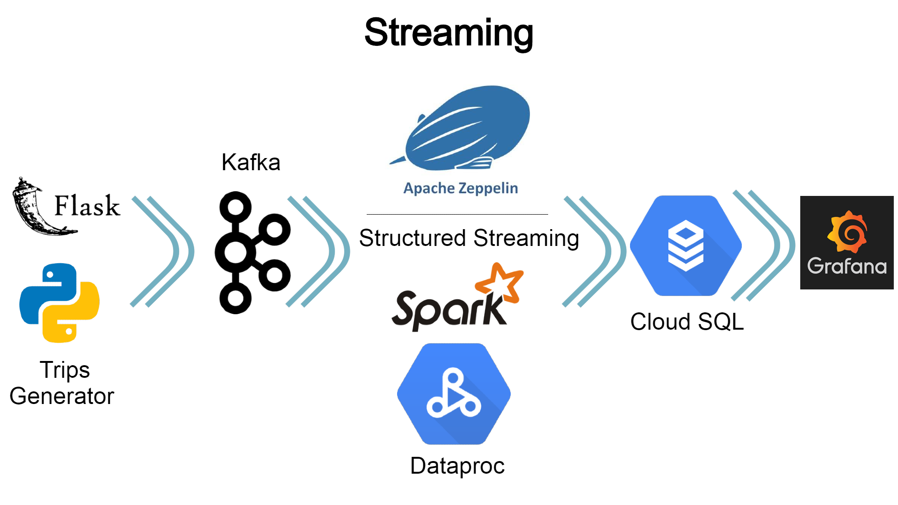

# NYC_TaxiTrips
Pipeline de dados utilizando o dataset sobre corridas de táxi em Nova York, com o objetivo de responder as perguntas listadas no arquivo "questions.txt".

O projeto foi implementado dentro da Google Cloud Platform com algumas limitações do período gratuito.

Os notebooks do Zeppelin se encontram na pasta "zeppelin_notebooks". 
Na pasta "spark_code" há o mesmo conteúdo dos notebooks em formato txt, para visualizar sem a necessidade de abrir no Zeppelin.

O código do servidor Python/Flask responsável por gerar registros de "trips" no Kafka se encontra na pasta "generate_trips".

**Questões**:

As questões se encontram no arquivo "questions.txt"

**Respostas**:
- Acesse o dashboard do Grafana pela url: https://34.87.253.30:3000/d/D800QM8Wz/nyc_trips?orgId=1&from=1580684239592&to=1580684539592&refresh=10s
- Visualize as respostas das questões em cada painel
- Passar o mouse no ícone "i" de cada painel exibe a pergunta correspondente

**Streaming**:

Com o dashboard do Grafana aberto faça o seguinte procedimento:
- Observe o mapa do painel "Extra 3"
- Faça uma requisição GET pela url: http://34.87.253.30:5000/push-trips
- Irá produzir 2 registros de trips no Kafka
- Visualize no dashboard as novas coordenadas no mapa
